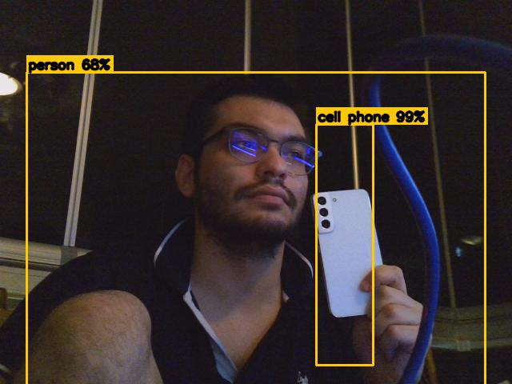

# Tiny YOLO on PYNQ-Z2 (DPU)

PYNQ-Z2 uzerinde **Tiny YOLO** nesne tespiti: USB webcam, FPGA **DPU** (DNNDK) ile hizlandirilmis inference ve **tarayici web panosu**.

Bu proje, [YOLO on PYNQ-Z2](https://github.com/andre1araujo/YOLO-on-PYNQ-Z2) (Andre Araujo) kurulumunun uzerine optimize edilmis video kodu ve canli web arayuzu ekler.



## Ozellikler

- Canli USB webcam + DPU inference (~6 FPS, ortam isigina bagli)
- Web panosu: `http://192.168.2.99:8080` (X11 gerekmez)
- 80 COCO sinifi (person, car, cell phone, bottle, ...)
- FPS, anlik tespit listesi, guven cubuklari
- Snapshot indir, duraklat, sinif bazli uyari
- Optimize on-isleme (MJPEG kamera, hizli letterbox)

## Gereksinimler

| Parca | Aciklama |
|--------|----------|
| Kart | PYNQ-Z2 |
| SD imaj | PetaLinux **pynqz2_dpu** ([DPU imaj](https://github.com/andre1araujo/YOLO-on-PYNQ-Z2)) |
| Guc | REG jumper + adaptör |
| Kamera | UVC USB webcam |
| PC | Ethernet + tarayici |

> `model/dpu_tiny_yolo.elf` bu repoda yok (buyuk dosya). Kurulum scripti PC'den veya GitHub'dan indirir.

## Hizli kurulum

### 1) SD karta DPU imaji (Windows)

`pynqz2_dpu_ml16.img` → [balenaEtcher](https://etcher.balena.io/) ile SD'ye yaz.

### 2) Baglanti

| | |
|---|---|
| Seri (PuTTY 115200) | `root` / `root` |
| Kart IP | `ifconfig eth0 192.168.2.99` |
| PC IP | `192.168.2.10` (script: `setup_pc_network.ps1`) |

### 3) Kartta kurulum (seri konsol)

PC'de once HTTP sunucu (PowerShell, proje klasorunde):

```powershell
cd C:\Users\oalpe\Desktop\yolo_pynqz2
python -m http.server 8000
```

Kartta:

```bash
curl -s http://192.168.2.10:8000/install_from_pc.sh | sh
```

Tarayici: **http://192.168.2.99:8080**

### Guncelleme (kod degisince)

```bash
curl -s http://192.168.2.10:8000/update.sh | sh
```

## Web panosu

| Ozellik | Aciklama |
|---------|----------|
| Canli video | Kutulu kamera goruntusu |
| FPS / sayaclar | Anlik ve toplam tespit |
| Sinif listesi | Gecmis oturumda gorulen siniflar |
| Snapshot | Kareyi PNG indir |
| Uyari | Secilen sinif (or. person) gorunce kirmizi cerceve |

## Terminal (X11)

```bash
cd ~/tiny_yolo_pynqz2
make -f makefile_video clean && make -f makefile_video
./tiny_yolo
```

## Proje yapisi

```
yolo_pynqz2/
├── programs/
│   ├── tiny_yolo_web.cpp      # web panosu + DPU
│   └── tiny_yolo_video.cpp    # X11 / terminal
├── makefile_web / makefile_video
├── install_from_pc.sh         # ilk kurulum
├── update.sh                  # hizli guncelleme
├── setup_pc_network.ps1
├── run_yolo_web.sh
├── docs/                      # ornek goruntuler
└── KOMUTLAR.txt
```

## Kaynak

- [andre1araujo/YOLO-on-PYNQ-Z2](https://github.com/andre1araujo/YOLO-on-PYNQ-Z2)
- [YOLO on PYNQ-Z2 (GitBook)](https://andre-araujo.gitbook.io/yolo-on-pynq-z2/)

## Lisans

MIT — bkz. [LICENSE](LICENSE).
